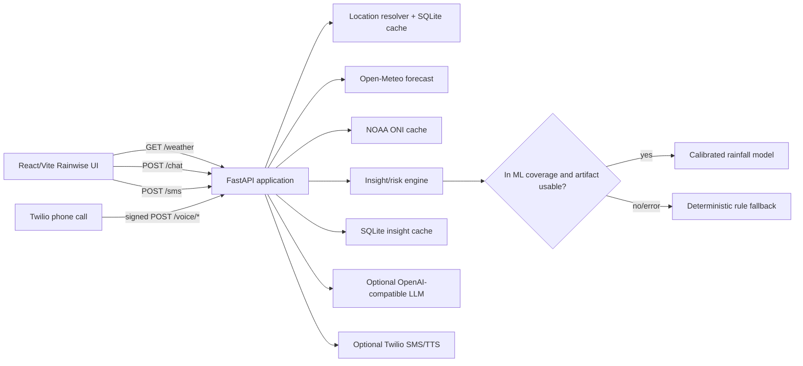

# Mazh AI / Rainwise — Complete Project Documentation

**Document basis:** repository working tree inspected on 2026-10-08. This
document describes the current source tree, including the Python backend, the
Vite/React frontend, the rainfall-risk model, the voice/SMS integrations, and
the deployment configuration.

## 1. Product overview

Mazh AI (branded as **Rainwise** in the frontend) is a rainfall-risk
intelligence application for weather-aware planning. It combines:

- A React dashboard for current conditions, hourly/daily rain probability,
  risk explanations, recommendations, and climate context.
- A FastAPI service that resolves a location, obtains weather data, builds a
  normalized insight, and exposes REST endpoints.
- A calibrated rainfall-risk model for the configured Tamil Nadu and
  Puducherry coverage area.
- Deterministic rule-based fallback scoring when the model is unavailable,
  disabled, outside coverage, or a live provider fails.
- Optional LLM-assisted intent parsing and response phrasing with strict
  numeric grounding validation.
- A keypad-only Twilio IVR in English and Tamil, with signed state tokens and
  optional cached custom TTS.
- Optional Twilio SMS delivery, with simulation when credentials are absent.

The service is designed to fail visibly and safely: provider failures are
logged, stale cache may be served, and the response metadata indicates whether
ML or a fallback path was used.

## 2. Repository layout

```text
.
├── backend/
│   ├── app/
│   │   ├── main.py                 FastAPI app, lifecycle, REST endpoints
│   │   ├── config.py               Environment and path configuration
│   │   ├── schemas.py              API request/response models
│   │   ├── cache.py                SQLite insight cache and refresh jobs
│   │   ├── climate_service.py      NOAA CPC ONI/ENSO cache
│   │   ├── location.py             PIN/place/reverse geocoding
│   │   ├── ml_engine.py            ML coverage and runtime adapter
│   │   ├── engine/insight.py       Risk calculations and insight generation
│   │   ├── providers/              Weather provider abstraction/Open-Meteo
│   │   ├── llm/                    Optional LLM client and prompt handling
│   │   ├── sms/                    Twilio SMS adapter
│   │   ├── voice/                  Twilio IVR, security, phrases, audio
│   │   └── prompts/                Intent and response prompt templates
│   ├── ml/
│   │   ├── data.py                 Historical weather/ENSO data acquisition
│   │   ├── features.py             Leakage-safe feature construction
│   │   ├── train.py                Model training, calibration, evaluation
│   │   └── infer.py                Versioned artifact loading and inference
│   ├── models/                     Checked-in rainfall model artifact
│   ├── scripts/                    PIN loading, simulation, benchmarking
│   ├── tests/                      API, engine, location, ML, and voice tests
│   ├── data/                       SQLite cache and ENSO cache
│   └── requirements.txt
├── config/
│   ├── cities.json                 IVR preset cities and coordinates
│   └── ml_coverage.json            ML bounding box and city metadata
├── frontend/
│   ├── src/App.tsx                 Application shell and loading/error flow
│   ├── src/api/client.ts           Typed API client and mock mode
│   ├── src/components/             Dashboard, picker, chat, SMS/IVR card
│   ├── src/hooks/                  Browser geolocation hook
│   ├── src/types/                  Frontend insight contract
│   ├── src/styles.css              Responsive visual design
│   └── vite.config.ts/vitest.config.ts
├── render.yaml                     Render backend Blueprint
├── .env.example                    Backend environment template
└── package-lock.json               Root lockfile
```

Generated or local-only content such as `frontend/node_modules/`,
`frontend/dist/`, Python caches, the SQLite cache, and generated audio should
not be treated as source documentation.

## 3. Runtime architecture



### Backend startup

`backend/app/main.py` creates the FastAPI app and runs a lifespan handler:

1. Preloads and validates the rainfall artifact.
2. Seeds the PIN database using `scripts/load_pincodes.py`.
3. Pre-warms fixed audio phrases when custom TTS is configured.
4. Starts preset-city warming and a 15-minute refresh scheduler.
5. Cancels the background tasks during shutdown.

The app also mounts generated audio at `/voice-audio`, enables CORS, applies a
60-request-per-minute in-memory IP window, and returns a JSON 500 response for
unhandled exceptions.

## 4. End-to-end weather request flow

`GET /weather` accepts one of:

- `lat` and `lon`
- `place`
- `pin`
- no location, which defaults to Chennai

The location resolver first uses local SQLite data where possible. Place names
use the Open-Meteo geocoder and then Nominatim as a fallback. Unknown PINs use
Nominatim after local lookup. Nominatim calls are serialized and throttled to
one request per second.

After location resolution, `get_or_build_insight`:

1. Looks up a coordinate-rounded cache key (two decimal places).
2. Returns a fresh cached insight when it is younger than 15 minutes.
3. Fetches current, 48-hour hourly, and seven-day daily forecast data from
   Open-Meteo.
4. Reads a daily NOAA CPC Oceanic Niño Index cache, fetching it if stale.
5. Calls `build_insight`.
6. Stores the result in SQLite.
7. If the provider fails, serves stale cached data when available; otherwise
   constructs a deterministic fallback weather payload and marks it as a
   fallback.

## 5. Insight and risk engine

`backend/app/engine/insight.py` produces the public insight contract.

### Rain windows

The next 24 hourly records are scanned for contiguous hours where either:

- rain probability is at least 60%, or
- expected rain is at least 1.5 mm.

Each window records start/end, maximum probability, total rain, and duration.

### Risk categories

Every response contains four categories:

| Category | Main inputs | Fallback thresholds |
|---|---|---|
| `heavy_rain` | ML score when eligible; otherwise 24-hour probability and rainfall | high at probability ≥75% or rain ≥30 mm; moderate at probability ≥50% or rain ≥10 mm |
| `heat` | current and apparent temperature | high at apparent ≥42°C or current ≥40°C; moderate at apparent ≥38°C or current ≥36°C |
| `wind` | current wind speed | high at ≥45 km/h; moderate at ≥25 km/h |
| `flood` | 24-hour accumulated rain and El Niño context | high at ≥60 mm, or ≥40 mm during El Niño; moderate at ≥20 mm |

Each risk has a score from 0 to 1, a low/moderate/high level, a time window,
confidence, and human-readable reasons. The generated insight also includes a
plain-language summary, recommendations, and an SMS message capped below 300
characters.

ENSO is seasonal context, not a short-term forecast. Unknown ENSO data is
represented as `unknown` rather than silently treated as El Niño or La Niña.

## 6. ML pipeline

The ML system is intentionally versioned and fail-closed.

### Coverage

Configured high-resolution coverage is the bounding box:

- Latitude: 8.0 to 13.8
- Longitude: 76.0 to 80.6
- Region: Tamil Nadu and Puducherry

Outside this region, or when `ML_ENABLED=false`, the service uses deterministic
forecast rules.

### Training

`backend/ml/data.py` downloads historical or historical-forecast hourly data
from Open-Meteo for cities in `config/ml_coverage.json`, caches it to SQLite
and CSV, and joins NOAA ONI data.

`backend/ml/features.py` builds leakage-safe rows. The target is whether the
next six hours reach `RAIN_THRESHOLD_MM` (default 10 mm). Features include
temperature, humidity, pressure changes, wind, recent rain, forecast rain
probability/amount, calendar fields, coordinates, elevation, and ENSO fields.
Training, validation, and test sets are separated chronologically by calendar
year without shuffling.

`backend/ml/train.py` compares XGBoost and balanced random forest models,
calibrates probabilities with isotonic regression, chooses a cutoff using
validation F1, evaluates against the raw forecast probability baseline, and
stores a version-2 artifact in `backend/models/rainfall_model.joblib`.

### Inference

`backend/ml/infer.py` validates artifact version and exact feature order before
loading. It produces a calibrated score, maps scores to:

- high: score ≥ 0.6
- moderate: score ≥ 0.3
- low: score < 0.3

The model also produces up to three positive contributing reasons. Runtime
inference uses zero values for unavailable pressure-history and recent-rain
fields because the public live weather response does not expose those histories.

## 7. REST API contract

| Method/path | Purpose | Main response |
|---|---|---|
| `GET /health` | Liveness/version check | `{status, timestamp, version}` |
| `GET /weather` | Resolve location and return full insight | `InsightSchema` |
| `POST /predict` | Return the heavy-rain prediction plus all risks | `PredictResponse` |
| `POST /chat` | Parse intent and generate grounded answer | `ChatResponse` |
| `POST /sms` | Validate and send/simulate one insight SMS | `SmsResponse` |
| `POST /voice/welcome` | Start IVR and request language | TwiML XML |
| `POST /voice/language` | Select English/Tamil | TwiML XML |
| `POST /voice/pin` | Collect and resolve a six-digit PIN | TwiML XML |
| `POST /voice/pin-confirm` | Confirm or re-enter PIN | TwiML XML |
| `POST /voice/city` | Select a preset city after PIN failure | TwiML XML |
| `POST /voice/menu` | Read rain/today/tomorrow/alerts menu views | TwiML XML |
| `POST /voice/sms-choice` | Choose SMS delivery mode | TwiML XML |
| `POST /voice/sms-number` | Collect and send a phone number | TwiML XML |

The canonical weather DTO is `InsightSchema` in `backend/app/schemas.py`; the
frontend mirrors it in `frontend/src/types/insight.ts`.

## 8. Chat behavior

The frontend creates a UUID session and sends the current coordinates with each
message. The backend:

1. Applies rule-based intent and language detection.
2. Uses the optional LLM to improve intent/location parsing.
3. Resolves the requested or session location.
4. Generates an answer from the insight.
5. Rejects LLM responses containing numbers absent from the insight JSON.
6. Falls back to deterministic English/Tamil templates on missing credentials,
   timeout, malformed output, or grounding failure.

Session history is process-local memory (`SESSION_HISTORY`); it is not durable
and is not shared between worker processes.

## 9. Voice and SMS behavior

The preferred low-cost phone deployment is Asterisk. The checked-in
`asterisk/extensions.conf` dialplan answers the call, collects a six-digit
PIN, and invokes the authenticated `/api/phone/*` FastAPI endpoints through
`asterisk/agi/mazh_weather.py`. Asterisk owns DTMF and call control; the
backend owns PIN lookup, weather retrieval, ML inference, risk scoring, and
voice-ready deterministic messages. The Asterisk setup requires a SIP trunk or
GSM gateway; the Asterisk software itself does not provide a telephone number
or free carrier minutes.

The IVR is keypad-only; it does not use speech recognition or an LLM. TwiML
prompts are fixed phrase templates filled with forecast output.

State is carried in a signed, base64url-encoded HMAC-SHA256 token with a
30-minute expiry. Twilio signatures are validated using the forwarded public
protocol/host so the flow works behind Render's proxy. Three idle prompts cause
the call to hang up. Two invalid PIN attempts transfer the caller to the
preset-city menu.

Menu choices are:

1. Rain risk
2. Today
3. Tomorrow
4. Alerts
5. SMS
9. Change location
0. Repeat menu

SMS validates E.164-compatible numbers and automatically prepends `+91` for a
10-digit Indian number. With complete Twilio credentials it calls the Twilio
REST API; otherwise it logs only the final four digits and returns a simulated
success response. Phone numbers are not persisted.

Custom TTS is optional. When configured, fixed phrase MP3s are SHA-256 cached,
pre-warmed at startup, and served from `/voice-audio`; failures fall back to
Twilio `<Say>`.

## 10. Frontend behavior

`frontend/src/App.tsx` is the page shell:

1. `useGeolocation` requests a low-accuracy browser location with an eight
   second timeout and five-minute cache.
2. Granted coordinates automatically load `/weather`.
3. Denied/unavailable location shows `LocationPicker`.
4. Loading renders skeleton cards; failures render a retry state.
5. A successful insight renders `Dashboard`, `ChatWidget`, and `PhoneCard`.

The dashboard displays:

- current weather and location
- seasonal climate badge
- highest risk gauge and high-risk banner
- next 24 hours
- seven-day rain probability
- risk reasons and confidence wording
- recommendations and fallback/standard-forecast notice

`frontend/src/api/client.ts` provides a ten-second request timeout and a
`VITE_USE_MOCK=true` demo mode. Only public `VITE_*` settings belong in the
frontend; backend credentials must remain server-side.

## 11. Configuration and deployment

### Local backend

```powershell
cd backend
python -m venv .venv
.venv\Scripts\Activate.ps1
pip install -r requirements.txt
python scripts/load_pincodes.py
uvicorn app.main:app --reload --host 0.0.0.0 --port 8000
```

### Local frontend

```powershell
cd frontend
npm install
npm run dev
```

Set `VITE_API_URL=http://localhost:8000` and `VITE_USE_MOCK=false` for a live
backend, or use mock mode for a backend-free UI demo.

### Render and Vercel

`render.yaml` deploys `backend/` as the `mazh-ai-api` Python web service in
Singapore. It runs `pip install -r requirements.txt` and starts Uvicorn on
Render's `$PORT`, with `/health` as the health check.

The frontend is Vercel-ready through `frontend/vercel.json`. Set
`VITE_API_URL` to the deployed Render origin and `VITE_USE_MOCK=false`.
Configure the Twilio inbound webhook as:

```text
POST https://<render-service>/voice/welcome
```

The local SQLite database, ENSO cache, and generated voice files are ephemeral
on the Render free service. Use a persistent disk or external storage if cache
retention is required.

## 12. Environment variables

| Variable group | Variables | Role |
|---|---|---|
| Server | `PORT`, `HOST`, `ENV`, `CORS_ORIGINS` | HTTP binding and runtime policy |
| Cache | `DATABASE_URL` | SQLite path/URL |
| ML | `ML_ENABLED`, `RAIN_THRESHOLD_MM` | Model switch and target threshold |
| LLM | `LLM_BASE_URL`, `LLM_MODEL`, `LLM_API_KEY` or `GEMINI_API_KEY` | Optional chat provider |
| Twilio | `TWILIO_ACCOUNT_SID`, `TWILIO_AUTH_TOKEN`, `TWILIO_PHONE_NUMBER` | SMS and signature validation |
| Voice | `VOICE_STATE_SECRET`, `VOICE_BASE_URL` | Signed IVR state and public action URLs |
| TTS | `TTS_PROVIDER`, `TTS_API_URL`, `TTS_API_KEY`, `TTS_VOICE_EN`, `TTS_VOICE_TA`, `VOICE_AUDIO_PUBLIC_URL` | Optional custom audio |
| Frontend | `VITE_API_URL`, `VITE_PHONE_NUMBER`, `VITE_USE_MOCK` | Public UI configuration |

Never place backend secrets in `frontend/.env.local` or any `VITE_*` variable.

## 13. Testing and verification

Backend tests cover:

- health, weather, prediction, chat, SMS, and numeric grounding
- rain-window detection and insight schema construction
- known/invalid/unknown PIN and place/reverse geocoding
- IVR confirmation, invalid PIN fallback, tampered token rejection, idle
  hang-up, preset-city selection, and SMS menu paths
- feature ordering, future-data leakage protection, chronological splits,
  coverage boundaries, and forced fallback behavior

Run:

```powershell
cd backend
pytest -q
python scripts/simulate_call.py --pin 600001
python scripts/simulate_call.py --city-fallback
python scripts/benchmark_voice.py
```

Frontend tests and build:

```powershell
cd frontend
npm test
npm run build
```

The live-provider location/weather tests depend on network access and the
local SQLite seed. The voice tests run without a Twilio secret in development;
production requests must include a valid Twilio signature.

## 14. Operational considerations and known boundaries

- The rate limiter is per-process memory, so it is not a distributed limit
  across multiple workers or instances.
- SQLite cache writes are local and ephemeral in the default Render setup.
- LLM session history is process-local and has no retention policy.
- The LLM is optional; the deterministic response path is the reliability
  baseline.
- ML inference is limited by the configured geographic bounding box and
  checked-in artifact contract.
- Open-Meteo, Nominatim, NOAA, Twilio, and custom TTS are external
  dependencies with their own availability and latency.
- CORS defaults include `*` for local convenience; production should use the
  exact deployed frontend origin.
- The checked-in `backend/models/rainfall_model.joblib` must remain compatible
  with the version-2 feature contract when retraining.
- Climate context should be presented as seasonal context, not as a direct
  short-term weather prediction.

## 15. Recommended maintenance workflow

1. Keep API changes synchronized between `backend/app/schemas.py`,
   `frontend/src/types/insight.ts`, and `frontend/src/api/client.ts`.
2. Add a focused backend test for each endpoint or fallback behavior change.
3. Run ML feature tests before replacing the model artifact.
4. Verify `/health`, a live `/weather` request, and one signed IVR path after
   deployment.
5. Review logs for provider timeouts, fallback usage, cache refresh failures,
   and voice latency.
6. Keep secrets only in the deployment provider's secret store.
